# [📈 Live Status](https://joshahubbers.github.io/DvO-uptime): <!--live status--> **🟧 Partial outage**

This repository contains the open-source uptime monitor and status page for [Josha Hubbers](https://joshahubbers.github.io/DvO-uptime), powered by [Upptime](https://github.com/upptime/upptime).

With [Upptime](https://upptime.js.org), you can get your own unlimited and free uptime monitor and status page, powered entirely by a GitHub repository. We use [Issues](https://github.com/joshahubbers/DvO-uptime/issues) as incident reports, [Actions](https://github.com/joshahubbers/DvO-uptime/actions) as uptime monitors, and [Pages](https://joshahubbers.github.io/DvO-uptime) for the status page.

<!--start: status pages-->
<!-- This summary is generated by Upptime (https://github.com/upptime/upptime) -->
<!-- Do not edit this manually, your changes will be overwritten -->
<!-- prettier-ignore -->
| URL | Status | History | Response Time | Uptime |
| --- | ------ | ------- | ------------- | ------ |
|  [Amersfoort](https://www.amersfoort.nl) | 🟥 Down | [amersfoort.yml](https://github.com/joshahubbers/DvO-uptime/commits/HEAD/history/amersfoort.yml) | 

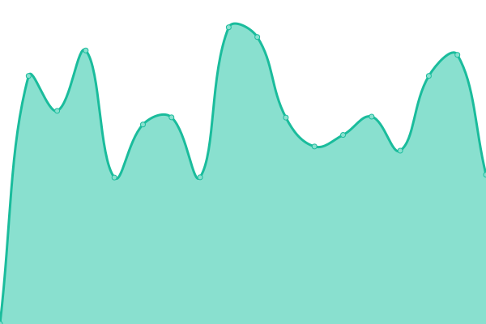 1070ms
     
 | 

<a href="https://joshahubbers.github.io/DvO-uptime/history/amersfoort">97.08%</a>
    

|  [Amstelveen](https://www.amstelveen.nl) | 🟥 Down | [amstelveen.yml](https://github.com/joshahubbers/DvO-uptime/commits/HEAD/history/amstelveen.yml) | 

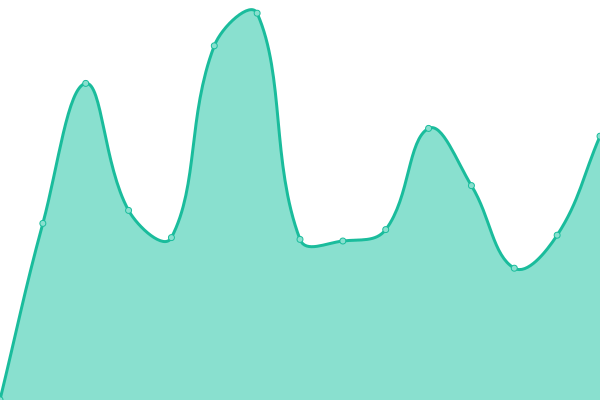 1289ms
     
 | 

<a href="https://joshahubbers.github.io/DvO-uptime/history/amstelveen">97.10%</a>
    

|  [Bevelanden](https://www.grdebevelanden.nl) | 🟩 Up | [bevelanden.yml](https://github.com/joshahubbers/DvO-uptime/commits/HEAD/history/bevelanden.yml) | 

 874ms
     
 | 

<a href="https://joshahubbers.github.io/DvO-uptime/history/bevelanden">100.00%</a>
    

|  [Breda](https://www.breda.nl) | 🟥 Down | [breda.yml](https://github.com/joshahubbers/DvO-uptime/commits/HEAD/history/breda.yml) | 

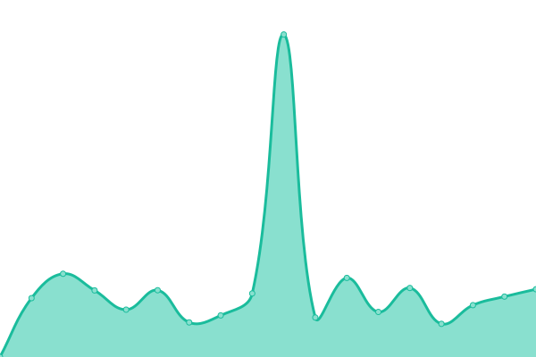 2036ms
     
 | 

<a href="https://joshahubbers.github.io/DvO-uptime/history/breda">97.12%</a>
    

|  [Dantumadiel](https://www.dantumadiel.frl) | 🟥 Down | [dantumadiel.yml](https://github.com/joshahubbers/DvO-uptime/commits/HEAD/history/dantumadiel.yml) | 

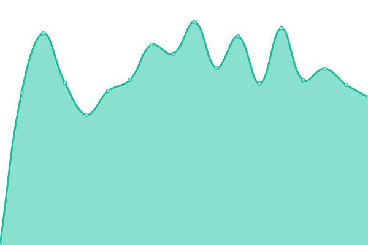 1170ms
     
 | 

<a href="https://joshahubbers.github.io/DvO-uptime/history/dantumadiel">97.14%</a>
    

|  [Delft](https://www.delft.nl) | 🟥 Down | [delft.yml](https://github.com/joshahubbers/DvO-uptime/commits/HEAD/history/delft.yml) | 

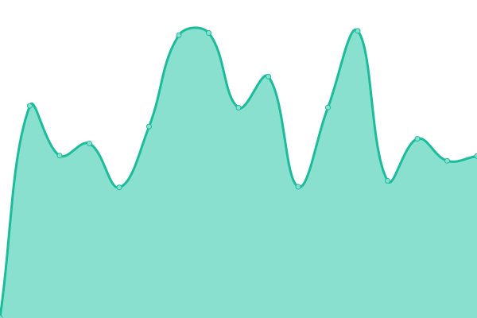 869ms
     
 | 

<a href="https://joshahubbers.github.io/DvO-uptime/history/delft">97.16%</a>
    

|  [DvO Demo](https://prod.dvgemdemo.hosted-temp.com) | 🟩 Up | [dv-o-demo.yml](https://github.com/joshahubbers/DvO-uptime/commits/HEAD/history/dv-o-demo.yml) | 

 1660ms
     
 | 

<a href="https://joshahubbers.github.io/DvO-uptime/history/dv-o-demo">99.76%</a>
    

|  [Edam-Volendam](https://www.edam-volendam.nl) | 🟩 Up | [edam-volendam.yml](https://github.com/joshahubbers/DvO-uptime/commits/HEAD/history/edam-volendam.yml) | 

 845ms
     
 | 

<a href="https://joshahubbers.github.io/DvO-uptime/history/edam-volendam">100.00%</a>
    

|  [Eemsdelta](https://www.eemsdelta.nl) | 🟩 Up | [eemsdelta.yml](https://github.com/joshahubbers/DvO-uptime/commits/HEAD/history/eemsdelta.yml) | 

 834ms
     
 | 

<a href="https://joshahubbers.github.io/DvO-uptime/history/eemsdelta">100.00%</a>
    

|  [Epe](https://www.epe.nl) | 🟥 Down | [epe.yml](https://github.com/joshahubbers/DvO-uptime/commits/HEAD/history/epe.yml) | 

 1031ms
     
 | 

<a href="https://joshahubbers.github.io/DvO-uptime/history/epe">97.17%</a>
    

|  [Gennep](https://www.gennep.nl) | 🟩 Up | [gennep.yml](https://github.com/joshahubbers/DvO-uptime/commits/HEAD/history/gennep.yml) | 

 825ms
     
 | 

<a href="https://joshahubbers.github.io/DvO-uptime/history/gennep">100.00%</a>
    

|  [Haarlem](https://haarlem.nl) | 🟥 Down | [haarlem.yml](https://github.com/joshahubbers/DvO-uptime/commits/HEAD/history/haarlem.yml) | 

 1201ms
     
 | 

<a href="https://joshahubbers.github.io/DvO-uptime/history/haarlem">97.19%</a>
    

|  [Krimpenerwaard](https://www.krimpenerwaard.nl) | 🟥 Down | [krimpenerwaard.yml](https://github.com/joshahubbers/DvO-uptime/commits/HEAD/history/krimpenerwaard.yml) | 

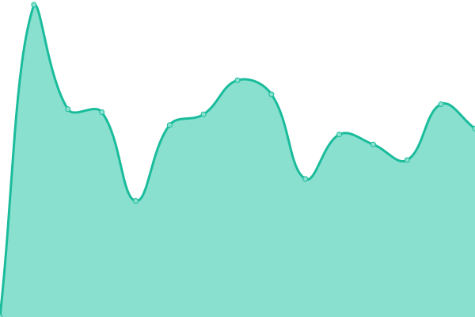 915ms
     
 | 

<a href="https://joshahubbers.github.io/DvO-uptime/history/krimpenerwaard">97.21%</a>
    

|  [Mechelen](https://www.mechelen.be) | 🟩 Up | [mechelen.yml](https://github.com/joshahubbers/DvO-uptime/commits/HEAD/history/mechelen.yml) | 

 1817ms
     
 | 

<a href="https://joshahubbers.github.io/DvO-uptime/history/mechelen">100.00%</a>
    

|  [Midden-Groningen](https://www.midden-groningen.nl) | 🟩 Up | [midden-groningen.yml](https://github.com/joshahubbers/DvO-uptime/commits/HEAD/history/midden-groningen.yml) | 

 1004ms
     
 | 

<a href="https://joshahubbers.github.io/DvO-uptime/history/midden-groningen">100.00%</a>
    

|  [Molenlanden](https://www.molenlanden.nl) | 🟥 Down | [molenlanden.yml](https://github.com/joshahubbers/DvO-uptime/commits/HEAD/history/molenlanden.yml) | 

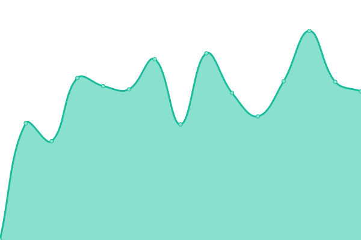 863ms
     
 | 

<a href="https://joshahubbers.github.io/DvO-uptime/history/molenlanden">97.23%</a>
    

|  [Montferland](https://www.montferland.info) | 🟩 Up | [montferland.yml](https://github.com/joshahubbers/DvO-uptime/commits/HEAD/history/montferland.yml) | 

 1108ms
     
 | 

<a href="https://joshahubbers.github.io/DvO-uptime/history/montferland">100.00%</a>
    

|  [Noaberkracht](https://www.dinkelland.nl) | 🟥 Down | [noaberkracht.yml](https://github.com/joshahubbers/DvO-uptime/commits/HEAD/history/noaberkracht.yml) | 

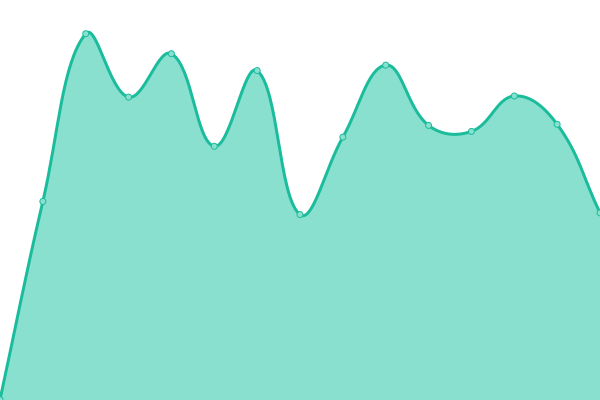 956ms
     
 | 

<a href="https://joshahubbers.github.io/DvO-uptime/history/noaberkracht">97.40%</a>
    

|  [Noardeast-Fryslan](https://www.noardeast-fryslan.nl) | 🟥 Down | [noardeast-fryslan.yml](https://github.com/joshahubbers/DvO-uptime/commits/HEAD/history/noardeast-fryslan.yml) | 

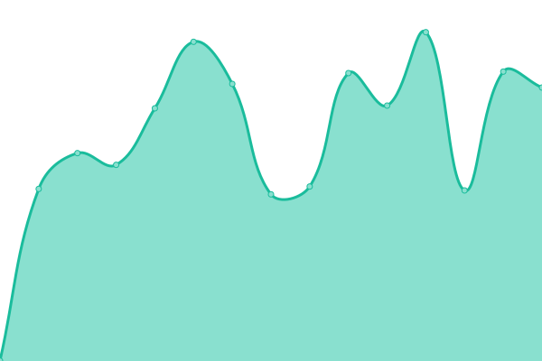 964ms
     
 | 

<a href="https://joshahubbers.github.io/DvO-uptime/history/noardeast-fryslan">97.41%</a>
    

|  [Noordenveld](https://www.noordenveld.nl) | 🟥 Down | [noordenveld.yml](https://github.com/joshahubbers/DvO-uptime/commits/HEAD/history/noordenveld.yml) | 

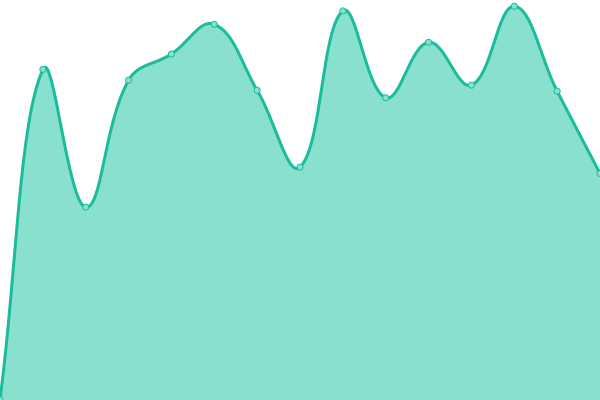 1061ms
     
 | 

<a href="https://joshahubbers.github.io/DvO-uptime/history/noordenveld">97.43%</a>
    

|  [Oude IJsselstreek](https://www.oude-ijsselstreek.nl) | 🟩 Up | [oude-i-jsselstreek.yml](https://github.com/joshahubbers/DvO-uptime/commits/HEAD/history/oude-i-jsselstreek.yml) | 

 835ms
     
 | 

<a href="https://joshahubbers.github.io/DvO-uptime/history/oude-i-jsselstreek">100.00%</a>
    

|  [Rijswijk](https://www.rijswijk.nl) | 🟥 Down | [rijswijk.yml](https://github.com/joshahubbers/DvO-uptime/commits/HEAD/history/rijswijk.yml) | 

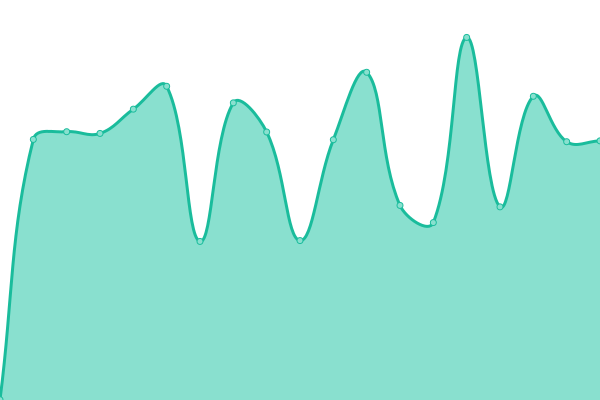 955ms
     
 | 

<a href="https://joshahubbers.github.io/DvO-uptime/history/rijswijk">97.45%</a>
    

|  [Rotterdam](https://www.rotterdam.nl) | 🟥 Down | [rotterdam.yml](https://github.com/joshahubbers/DvO-uptime/commits/HEAD/history/rotterdam.yml) | 

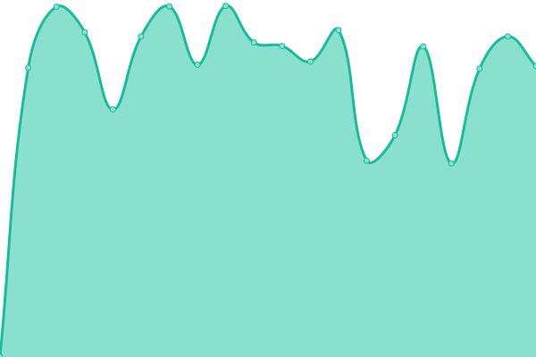 750ms
     
 | 

<a href="https://joshahubbers.github.io/DvO-uptime/history/rotterdam">97.46%</a>
    

|  [Rotterdam stadsarchief](https://stadsarchief.rotterdam.nl) | 🟥 Down | [rotterdam-stadsarchief.yml](https://github.com/joshahubbers/DvO-uptime/commits/HEAD/history/rotterdam-stadsarchief.yml) | 

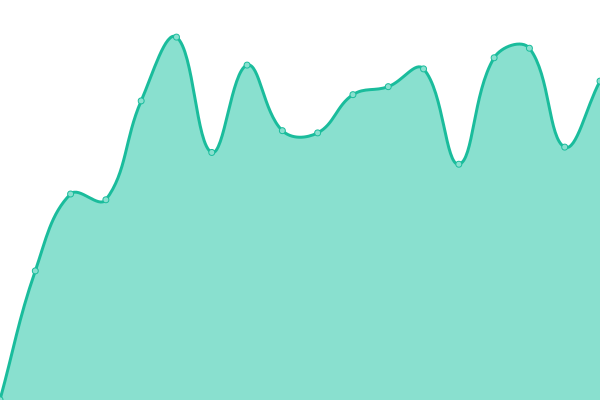 1251ms
     
 | 

<a href="https://joshahubbers.github.io/DvO-uptime/history/rotterdam-stadsarchief">97.48%</a>
    

|  [Schagen](https://www.schagen.nl) | 🟩 Up | [schagen.yml](https://github.com/joshahubbers/DvO-uptime/commits/HEAD/history/schagen.yml) | 

 877ms
     
 | 

<a href="https://joshahubbers.github.io/DvO-uptime/history/schagen">100.00%</a>
    

|  [Venlo](https://www.venlo.nl) | 🟩 Up | [venlo.yml](https://github.com/joshahubbers/DvO-uptime/commits/HEAD/history/venlo.yml) | 

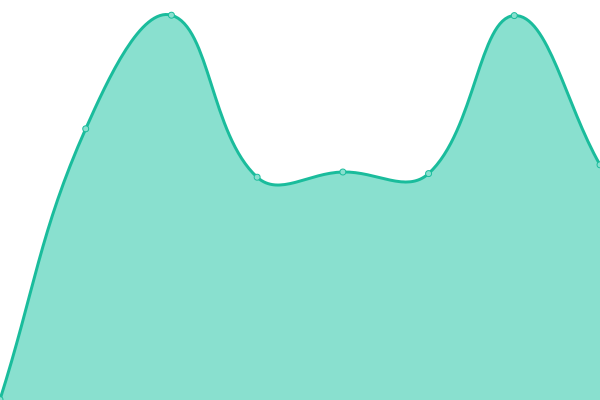 797ms
     
 | 

<a href="https://joshahubbers.github.io/DvO-uptime/history/venlo">100.00%</a>
    

|  [Westerwolde](https://www.westerwolde.nl) | 🟩 Up | [westerwolde.yml](https://github.com/joshahubbers/DvO-uptime/commits/HEAD/history/westerwolde.yml) | 

 931ms
     
 | 

<a href="https://joshahubbers.github.io/DvO-uptime/history/westerwolde">100.00%</a>
    

<!--end: status pages-->

[**Visit our status website →**](https://joshahubbers.github.io/DvO-uptime)

## 📄 License

- Powered by: [Upptime](https://github.com/upptime/upptime)
- Code: [MIT](./LICENSE) © [Anand Chowdhary](https://anandchowdhary.com), supported by [Pabio](https://pabio.com)
- Data in the `./history` directory: [Open Database License](https://opendatacommons.org/licenses/odbl/1-0/)
